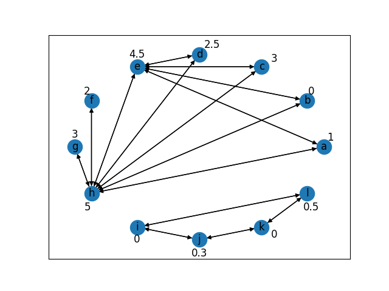

# Overview of core functionalities

# Trustworthiness calculation

The trustworthiness score is an integer value in the range [0..5]. It is being calculated based on a variety of factors 
described below.

## Stored in database?
The score is stored in the database to enable the tracking of its history. This offers the user the option to evaluate
how the trustworthiness of an NGO has developed over time.

Stored in the database:
- total trustworthiness score
- score resulting from the credibility of its data source
- score resulting from the number of data sources it is being derived from
- score resulting from its accreditations

Storing these individual factors enables offering a detailed history of the trustworthiness score.

:exclamation: This means that the score has to be updated every time an influencing factors is added or updated.

## Which factors are currently being used?

- credibility of data source(s)
- number of data sources
- [ECOSOC](https://csonet.org/?menu=100) accreditation 
- PageRank

## What additional features could potentially be used in the future?
- use more of the accreditations listed in the database
- query [UN ECOSOC](https://esango.un.org/civilsociety/displayConsultativeStatusSearch.do?method=search&sessionCheck=false)
for more accreditation information (also lists other accreditations)
- user ratings
- reported scandals
- NGO size (members, staff; could disadvantage smaller NGOs)
- age of NGO

## What are the requirements to currently receive an optimal trustworthiness score? 

- listed by one credible source
- listed by all data sources
- ECOSOC/ILO/Commonwealth Foundation (CF) accredited
- PageRank TODO

## What is the current score distribution?
| Score | # NGOs |
| ----- | ------: |
| 0 | 649 |
| 1 | 0 |
| 2 | 0 |
| 3 | 264 |
| 4 | 48 |
| 5 | 2 |

## How is the score calculated?

### Base TW score

Most straightforward option:
- max. number of data sources: 2
- max. credibility: (# data sources) x yes
- max. accreditation: ECOSOC yes OR ILO yes OR CF yes

However, an NGO should not be punished with a lower rating simply because we add a new, less credible data-source.
It should be possible to obtain the optimal score with only one credible data source.

Further considerations:
- an NGO with one credible data source should have a better rating than an NGO with multiple less credible sources
- but the number of data sources should be correlated to the score
- more than one credible source does not make the NGO more credible

The following factors will be used to calculate the raw base tw score:

| Factor                | Value                        | current max. value |Reasoning |
| --------------------- | ----------------------------- | -------- | --------- |
| # data sources        | 1 per source | 2 | |
| one credible source   | (# data sources overall) * 2 + 1  | 5 | one credible source > all (less) credible sources combined + ECOSOC |
| ECOSOC/ILO/CF              | # data sources overall | 2 | ECOSOC/ILO/CF does not hold as much meaning without a credible source |

score_raw_base(NGO) = (# data sources listing NGO) + (credible_source(NGO)) + ECOSOC_ILO_CF(NGO)

Since the score has to be scaled into the range [0..5], use the following [formula](https://stats.stackexchange.com/questions/281162/scale-a-number-between-a-range/281164) to achieve this:

| Variable | Value | Description |
| -------- | ----- | ----------- |
| rmin | 1 | min. value of raw base TW score (i.e. one data source and nothing else) |
| r max | 9 | max. value of raw base TW score |
| tmin | 0 | min. value of TW score |
| tmax | 5 | max. value of TW score |

score_raw_base_scaled = [(score_raw_base - rmin) / (rmax - rmin)] * (tmax - tmin) + tmin

### User TW score

Since the rating of the users for an NGO is to be taken into account in the overall rating, a user tw score is now also calculated.

The raw score is calculated as follows:
score_raw_user(NGO) = sum_commenter_ratings / amount_commenter_ratings

Since the score has to be scaled into the range [0..5], the same formula is used as with the base tw score:

| Variable | Value | Description |
| -------- | ----- | ----------- |
| rmin | 0 | min. value of raw user TW score (no rating has been given until now) |
| r max | amount_commenter_ratings * TW_MAX_VALUE | max. value of raw user TW score |
| tmin | 0 | min. value of TW score |
| tmax | 5 | max. value of TW score |

score_raw_user_scaled = [(score_raw_user - rmin) / (rmax - rmin)] * (tmax - tmin) + tmin

### Total TW score

The total tw score is then calculated as follows:
* If no rating has been given until now:

total_tw_score = score_raw_base_scaled

* Otherwise:

total_tw_score = score_raw_base_scaled * (1 - user_tw_factor) + score_raw_user_scaled * user_tw_factor

where user_tw_factor results from the share of NGO ratings in the total number of ratings.
This is to prevent individual comments from being weighted disproportionately.

## PageRank
The original PageRank-algorithm relies on how many links are pointing to a website (and how many outgoing links the source of the link has). 
However, for our use case this seems problematic:

Let's say we have 5 NGOs with a fairly low trustworthiness ranking. They are all pairwise connected. A lot of trustworthy NGOs
are not connected to other NGOs. In this case, the 5 not very trustworthy NGO would receive a trustworthiness boost. This would 
encourage untrustworthy NGOs to - fraudulently? -  connect to each other as much as possible; ultimately leading to: untrustworthy 
NGOs being preferred by our algorithm.

This is the **exact opposite** of what we want.

Of course, the PageRank result is just one factor of the trustworthiness score, so it might not influence the score too much. 
But still, providing a bonus for untrustworthy NGOs - however small - would decrease the user's trust in our trustworthiness
score and should be avoided at all cost.  

Therefore, we are using the Personalized PageRank-algorithm:
This modification of the original PageRank-algorithm essentially takes into account that users do not randomly click on links,
but are more likely to follow links that interest them.

In our case, we are not using user preference, but instead base the customization on the pre-existing trustworthiness ranking.
This means that NGOs connected to other NGOs with a higher trustworthiness score so far are used as starting points for the random walk and NGOs 
connected to them are more likely to receive a higher score.

### Example
This example explains the problem with the original PageRank-algorithm in our application and the effect of personalization in more detail.

#### Case Study
Throughout the example, the following NGOs and their connections will be used (NGO names in nodes, TW score next to it):

The upper cycle contains NGOs with mostly medium to high trustworthiness. The lower cycle represents a group of 
untrustworthy NGOs who have linked together to try to boost their own rating (which our application should avoid).

#### PageRank calculation

Intuitively, NGOs in the upper cycle should profit from their connections much more than NGOs in the lower cycle.

However, the original PageRank-algorithm outputs:

| NGO | PageRank |  | NGO | PageRank |
| --- | -------- |---|-----|----------|
| a   | 0.06        | | i | 0.08|
| b   | 0.06        | | j | 0.08 |
| c   | 0.06        | | k | 0.08 |
| d   | 0.06        | | l | 0.08 |
| e   | 0.14        | | | |
| f   | 0.03        | | | |
| g   | 0.03        | | | |
| h   | 0.20        | | | |

The 'fraudulent' NGOs in the lower cycle receive a higher score than NGOs a, b, c, and d.

#### Personalized PageRank calculation

Instead, we calculate the personalization for each NGO as follows:  
tw_connected(NGO) = sum(total_tw_score for each NGO2 with NGO->NGO2)  
tw_sum = sum(tw_connected)  
personalization(NGO) = tw_connected(NGO) / tw_sum

The personalization needs to be scaled into the range [0,1] to work with our PageRank-library [NetworkX](https://networkx.org/).

Using these weights, the Personalized PageRank-algorithm outputs:

| NGO | PageRank |  | NGO | PageRank |
| --- | -------- |---|-----|----------|
| a   | 0.09        | | i | 0.005|
| b   | 0.09        | | j | 0.004 |
| c   | 0.09        | | k | 0.005 |
| d   | 0.09        | | l | 0.004 |
| e   | 0.21        | | | |
| f   | 0.04        | | | |
| g   | 0.04        | | | |
| h   | 0.30        | | | |

These results for NGOs a - h are very similar to the results that would have been achieved if the 'fraudulent' cycle
did not exist. 

- NGOs connected to more trustworthy NGOs receive a higher score
- the fraudulent NGOs only receive a small boost

### Remark on Possible Problems
- Dangling nodes (nodes with no outgoing edges): There are only completely isolated NGOs, since all links are assumed to
be bidirectional. This means, that all NGOs with incoming links also have outgoing links. NGOs without any links will 
simply not be used for the calculation (also reduces memory consumption, since the transition matrix will be a lot smaller)
Usually, they would receive the base PageRank of d/N, but in our case this is not necessary: NGOs without any connections
should not receive a trustworthiness boost, so it seems safe to simply exclude them.
- In case we should later switch to only unidirectional graphs, the personalization will still works as expected (tested).
But it might cause the dangling node-problem described above.

### Influence on TW score
The pagerank result is a float value between 0 and 1. This will be multiplied by a factor of # NGOs in PageRank and then
scaled into the range of [0, 2] meaning that the PageRank can at most lead to a TW score boost of 2. 

 
However, there is one more issue: In the case of only 2 connected NGOs, one with TW 3.8 and one with TW 0.0, the following would happen:  
NGO1 with TW 3.8 before would be boosted to TW 4.7  
NGO2 with TW 0.0 before would be boosted to TW 1.1

Pagerank inherently leads to a boost for NGO1, but we want this boost to be fairly small, since the connection to NGO2 
does not actually indicate a higher TW for NGO1. Therefore, we factor in the pre-calculated TW score again:  
A NGO with TW 5.0 before would not receive any boost (and it in fact **cannot**, since the TW is capped at 5).  
A NGO with TW 0.0 before can receive the max. boost of 2.

With this factoring, the above mentioned example changes to:  
NGO1 improves from 3.8 to around 4.  
NGO2 improves from 0.0 to 1.1.

## When will the score be calculated?
During the initial data import, the score will be calculated for each NGO. There also exists a URL to recalculate the
 score for all NGOs in the database if necessary (e.g. if the score calculation was modified).
 
The score is recalculated for a single NGO, when a new user rating is saved to the database and when an existing user
 rating is updated or deleted. In the future, a recalculation of the score for each NGO will be performed automatically
 in fixed intervals. This ensures, that the scores will be kept up-to-date, even if no changes are being made to 
 to specific NGOs, which would trigger a single recalculation.
